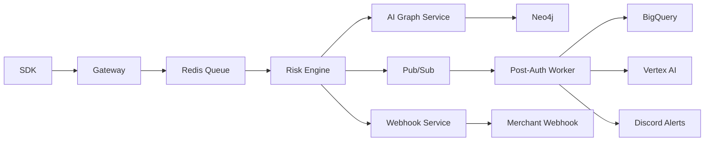

# Fintech Protective Layer  
End-to-End Architecture & API Reference

## Table of Contents
- [Overview](#overview)
- [End-to-End Request Flow](#end-to-end-request-flow)
- [Architecture Diagram](#architecture-diagram)
- [Storage Touchpoints](#storage-touchpoints)
- [Operational Notes](#operational-notes)
- [API Reference](#api-reference)
  - [Gateway Service](#1-gateway-service)
  - [AI Graph Service](#2-ai-graph-service)
  - [Tokenization Vault](#3-tokenization-vault)
  - [UPI Mock Service](#4-upi-mock-service)
- [Internal (Non-HTTP) Services](#internal-non-http-services)
- [Port-Forward Recipes](#port-forward-recipes)

# Overview

The Fintech Protective Layer is a GKE-native transaction risk assessment pipeline that receives merchant transactions, evaluates risk using rules, Redis, Neo4j graph intelligence, and LLM-based SAR generation, and notifies merchants via signed webhooks.

# End-to-End Request Flow

## 1. Client SDK / Middleware
- Generates and signs requests using HMAC.
- Sends POST /v1/transaction/assess.
- Handles retries and timeouts.

## 2. Gateway Service
- Validates HMAC headers.
- Pushes raw payload to Redis list `transaction_queue`.
- Returns 202 PENDING.

## 3. Redis
- Acts as an ingestion buffer.
- Risk Engine performs BRPOP.

## 4. Risk Engine
- Rule checks + graph lookups.
- Publishes to Pub/Sub and Redis channels.

## 5. AI Graph Service
- Updates Neo4j graph.
- Exposes /v1/ai/predict.

## 6. Post-Auth Worker
- Consumes Pub/Sub.
- Writes BigQuery audit logs.
- Generates SAR using Vertex AI.
- Sends Discord alerts.

## 7. Webhook Service
- Subscribes to Redis channels.
- Sends signed POST webhooks.

## 8. Downstream Clients
- Receive callbacks.
- Decrypt UPI mock payloads.

# Architecture Diagram



# Storage Touchpoints

| Component | Data | Durability |
|----------|------|------------|
| Redis | Queue + ephemeral events | In-memory with persistent disks |
| Neo4j | User graph | StatefulSet PV |
| BigQuery | Audit logs | Managed |
| Vertex AI | SAR outputs | Pod FS or GCS |

# Operational Notes

- Uses Kubernetes Secret `fintech-secrets`.
- GCP service account: `fintech-protective-layer@mumbaihacks-1.iam.gserviceaccount.com`.
- Deployment script: `deploy_gcp.ps1`.
- External entrypoint: `34.14.156.36`.

# API Reference

## 1. Gateway Service

### GET /health
Simple health check.

### POST /v1/transaction/assess
Submit a transaction for async risk evaluation.

Headers:
- x-client-id  
- x-timestamp  
- x-signature  

Returns 202 PENDING.

## 2. AI Graph Service
Port-forward required.

### POST /v1/ai/predict
Returns graph-based risk score.

### POST /v1/graph/update
Updates Neo4j relationships.

## 3. Tokenization Vault
- /v1/tokenize  
- /v1/detokenize  

## 4. UPI Mock Service
- POST /api/v1/composite-payment

# Internal (Non-HTTP) Services

| Service | Pattern | Testing |
|--------|---------|---------|
| Risk Engine | Redis queue | LPUSH test jobs |
| Post-Auth Worker | Pub/Sub | Publish events |
| Webhook Service | Redis pattern-sub | PUBLISH test results |

# Port-Forward Recipes

```
kubectl port-forward deployment/gateway 9300:3000
kubectl port-forward svc/redis 6379:6379
kubectl port-forward svc/neo4j 7474:7474 7687:7687
```
