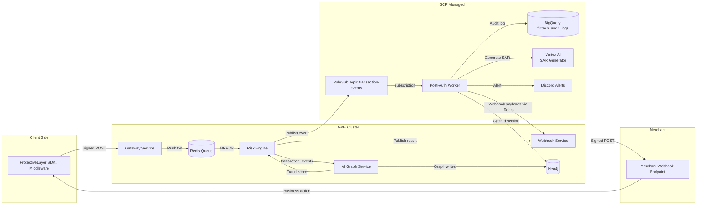

# End-to-End Request Flow

This document tracks how a transaction travels through the Fintech Protective Layer stack, from client call to external notifications.

## High-Level Narrative

1. **Client SDK / Middleware**
   - Signs the payload using the HMAC secret and calls `POST /v1/transaction/assess` on the gateway LoadBalancer (`34.14.156.36`).
   - Retries and timeout behavior are handled in the SDK.

2. **Gateway Service (GKE)**
   - Verifies HMAC headers and rate/anti-replay checks.
   - Runs DLP masking on responses.
   - Pushes the raw transaction JSON to the Redis list `transaction_queue` and acknowledges the client with `202 Pending`.

3. **Redis (GKE)**
   - Acts as the ingestion buffer.
   - Risk Engine performs a blocking `BRPOP` to fetch transactions.

4. **Risk Engine (GKE)**
   - Evaluates rules (amount, currency, velocity) and consults ai-graph-service/Redis when needed.
   - Publishes enriched results via:
     - **Google Pub/Sub** topic `transaction-events` (for post-auth worker).
     - **Redis Pub/Sub** channels `transaction_result:<txnId>` (for webhook-service).
     - **Redis channel `transaction_events`** (for ai-graph-service graph updates).

5. **AI Graph Service (GKE + Neo4j)**
   - Subscribes to `transaction_events`, updates Neo4j relationships, and exposes `/v1/ai/predict` for on-demand risk scoring.
   - Neo4j data can feed back into Risk Engine/Post-auth Worker.

6. **Post-Auth Worker (GKE + GCP managed services)**
   - Listens to Pub/Sub subscription `transaction-events-sub` using the shared service account (`mumbaihacks-1`).
   - Persists audit logs to **BigQuery** dataset `fintech_audit_logs.transactions`.
   - Runs **Neo4j** cycle detection and **Vertex AI (Gemini)** SAR generation.
   - Sends **Discord** alerts when SARs are produced.

7. **Webhook Service (GKE)**
   - Subscribes to Redis channels `transaction_result:*` and POSTs to merchant webhook URLs, signing payloads with the shared secret.

8. **Downstream Clients**
   - Receive webhook callbacks, decrypt UPI mock responses, or poll the SDK as needed.

Supporting services like **Tokenization Vault** and **UPI Mock** live on private subnets/ports and are invoked by gateway or integration tests before transactions enter the main pipeline.

## Mermaid Flow Diagram

## Storage Touchpoints

| Component | Data | Durability |
| --- | --- | --- |
| Redis | Transaction queue + ephemeral events | In-memory (cluster persistent disks) |
| Neo4j | User-to-user graph | Statefulset volumes in GKE |
| BigQuery | Immutable audit logs | Managed by GCP |
| Vertex AI | Generated SAR content (saved to worker pod filesystem + Discord) | Export files in pod / GCS if configured |

## Operational Notes

- All pods pull secrets from `fintech-secrets` (HMAC, Neo4j password, Discord webhook, GCP key).
- The service account `fintech-protective-layer@mumbaihacks-1.iam.gserviceaccount.com` authenticates GCP APIs.
- `deploy_gcp.ps1` rebuilds Docker images, pushes to `gcr.io/mumbaihacks-1/*`, and reapplies manifests.
- External access points: gateway LoadBalancer (`34.14.156.36`), Discord webhooks, merchant webhooks, and optional port-forward tunnels.
